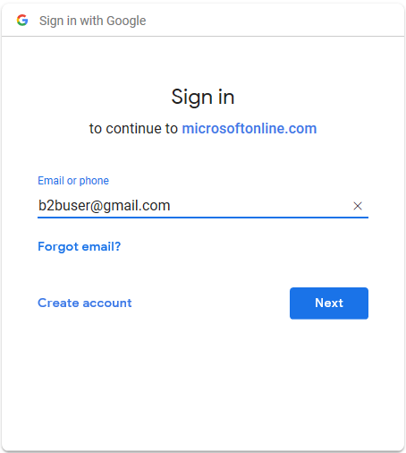
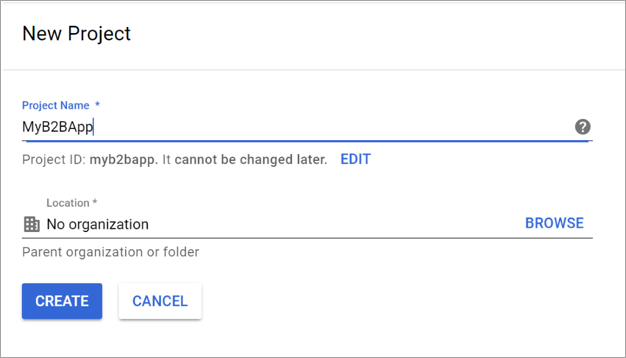
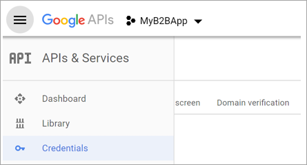
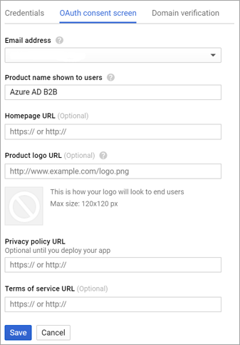
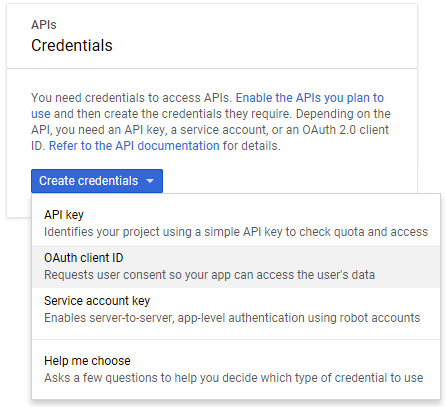
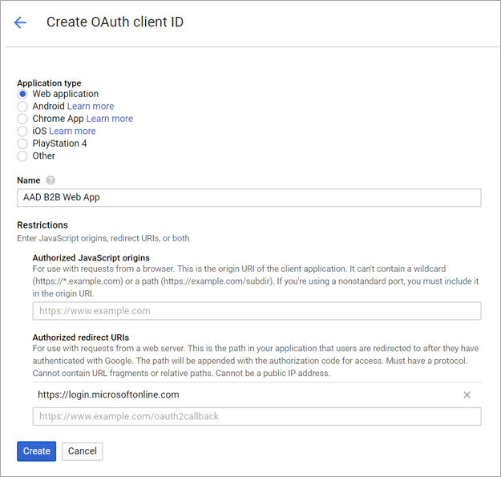
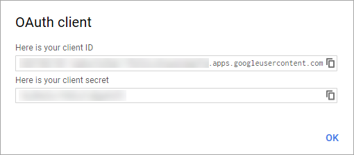

---

title: Add Google as an identity provider for Azure Active Directory B2B | Microsoft Docs
description: Federate with Google to enable guest users to sign in to your Azure AD apps with their own Gmail account

services: active-directory
ms.service: active-directory
ms.component: B2B
ms.topic: article
ms.date: 08/20/2018

ms.author: mimart
author: msmimart
manager: mtillman
ms.reviewer: mal

---

# Add Google as an identity provider for B2B guest users

By setting up federation with Google, you can allow invited users to sign in to your shared apps and resources with their own Google accounts, without having to create Microsoft Accounts (MSAs) or Azure AD accounts.  
> [!NOTE]
> Your Google guest users must sign in using a link that includes the tenant context, for example `https://myapps.microsoft.com/?tenantid=<tenant id>`. Direct links to applications and resources also work as long as they include the tenant context. Guest users are currently unable to sign in using endpoints that have no tenant context. For example, using `https://myapps.microsoft.com`, `https://portal.azure.com`, or the Teams common endpoint will result in an error.
 
## What is the experience for the Google user?
When you send an invitation to a Google Gmail user, the guest user should access your shared apps or resources using a link that includes the tenant context. Their experience varies depending on whether they're already signed in to Google:
  - If the guest user is not signed in to Google, they're prompted to sign in to Google.
  - If the guest user is already signed in to Google, they'll be prompted to choose the account they want to use. They must choose the account you used to invite them.

If the guest user sees a "header too long" error, they can try clearing their cookies, or they can open a private or incognito window and try signing in again.

## Step 1: Configure a Google developer project
First, create a new project in the Google Developers Console to obtain a client ID and a client secret that you can later add to Azure AD. 
1. Go to the Google APIs at https://console.developers.google.com, and sign in with your Google account. We recommend that you use a shared team Google account.
2. Create a new project: On the Dashboard, select **Create Project**, and then select **Create**. On the New Project page, enter a **Project Name**, and then select **Create**.
   
   

3. Make sure your new project is selected in the project menu. Then open the menu in the upper left and select **APIs & Services** > **Credentials**.

   
 
4. Choose the **Oauth consent screen** tab and enter a **Product name shown to users**. (Leave the other settings.) Select **Save**.

   

5. Choose the **Credentials** tab. In the **Create credentials** menu, choose **OAuth client ID**.

   

6. Under **Application type**, choose **Web application**, and then under **Authorized redirect URIs**, enter the following URIs:
   - `https://login.microsoftonline.com` 
   - `https://login.microsoftonline.com/te/<directory id>/oauth2/authresp`  (where `<directory id>` is your directory ID)
   
    > [!NOTE]
    > To find your directory ID, go to https://portal.azure.com, and under **Azure Active Directory**, choose **Properties** and copy the **Directory ID**.

   

7. Select **Create**. Copy the client ID and client secret, which you'll use when you add the identity provider in the Azure AD portal.

   

## Step 2: Configure Google federation in Azure AD 
Now you'll set the Google client ID and client secret, either by entering it in the Azure AD portal or by using PowerShell. Be sure to test your Google federation configuration by inviting yourself using a Gmail address and trying to redeem the invitation with your invited Google account. 

#### To configure Google federation in the Azure AD portal 
1. Go to the [Azure portal](https://portal.azure.com). In the left pane, select **Azure Active Directory**. 
2. Select **Organizational Relationships**.
3. Select **Identity providers**, and then click the **Google** button.
4. Enter a name. Then enter the client ID and client secret you obtained earlier. Select **Save**. 

   

#### To configure Google federation by using PowerShell
1. Install the latest version of the Azure AD PowerShell for Graph module ([AzureADPreview](https://www.powershellgallery.com/packages/AzureADPreview)).
2. Run the following command:
   `Connect-AzureAD`.
3. At the sign-in prompt, sign in with the managed Global Administrator account.  
4. Run the following command: 
   
   `New-AzureADMSIdentityProvider -Type Google -Name Google -ClientId [Client ID] -ClientSecret [Client secret]`
 
   > [!NOTE]
   > Use the client id and client secret from the app you created in "Step 1: Configure a Google developer project." For more information, see the [New-AzureADMSIdentityProvider](https://docs.microsoft.com/en-us/powershell/module/azuread/new-azureadmsidentityprovider?view=azureadps-2.0-preview) article. 
 
## How do I remove Google federation?
You can delete your Google federation setup. If you do so, Google guest users who have already redeemed their invitation will not be able to sign in, but you can give them access to your resources again by deleting them from the directory and re-inviting them. 
 
### To delete Google federation in the Azure AD portal: 
1. Go to the [Azure portal](https://portal.azure.com). In the left pane, select **Azure Active Directory**. 
2. Select **Organizational Relationships**.
3. Select **Identity providers**, and then click the **Google** button.
4. Select **Google**, and then select **Delete**. 
   
   

1. Select **Yes** to confirm deletion. 

### To delete Google federation by using PowerShell: 
1. Install the latest version of the Azure AD PowerShell for Graph module ([AzureADPreview](https://www.powershellgallery.com/packages/AzureADPreview)).
2. Run `Connect-AzureAD`.  
4. In the login in prompt, sign in with the managed Global Administrator account.  
5. Enter the following command:

    `Remove-AzureADMSIdentityProvider -Id Google-OAUTH`

   > [!NOTE]
   > For more information, see [Remove-AzureADMSIdentityProvider](https://docs.microsoft.com/en-us/powershell/module/azuread/Remove-AzureADMSIdentityProvider?view=azureadps-2.0-preview). 