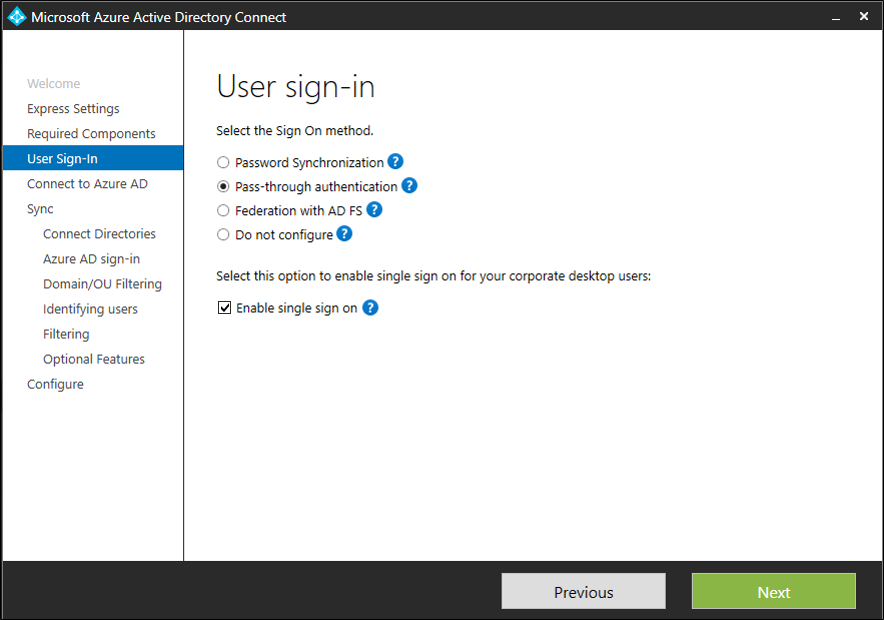
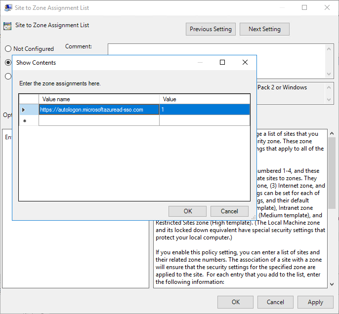
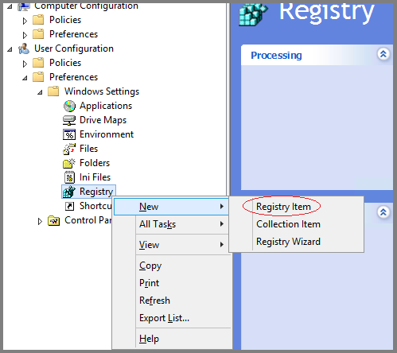
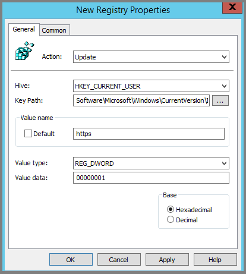

# Azure Active Directory Seamless Single Sign-On: Quick start

## Deploy Seamless Single Sign-On

Azure Active Directory (Azure AD) Seamless Single Sign-On (Seamless SSO) automatically signs in users when they are on their corporate desktops that are connected to your corporate network. Seamless SSO provides your users with easy access to your cloud-based applications without needing any additional on-premises components.

To deploy Seamless SSO, follow these steps.

## Step 1: Check the prerequisites

Ensure that the following prerequisites are in place:

* **Set up your Azure AD Connect server**: If you use [Pass-through Authentication](how-to-connect-pta.md) as your sign-in method, no additional prerequisite check is required. If you use [password hash synchronization](how-to-connect-password-hash-synchronization.md) as your sign-in method, and if there is a firewall between Azure AD Connect and Azure AD, ensure that:
   - You use version 1.1.644.0 or later of Azure AD Connect. 
   - If your firewall or proxy allows DNS whitelisting, whitelist the connections to the **\*.msappproxy.net** URLs over port 443. If not, allow access to the [Azure datacenter IP ranges](https://www.microsoft.com/download/details.aspx?id=41653), which are updated weekly. This prerequisite is applicable only when you enable the feature. It is not required for actual user sign-ins.

    >[!NOTE]
    >Azure AD Connect versions 1.1.557.0, 1.1.558.0, 1.1.561.0, and 1.1.614.0 have a problem related to password hash synchronization. If you _don't_ intend to use password hash synchronization in conjunction with Pass-through Authentication, read the [Azure AD Connect release notes](https://docs.microsoft.com/azure/active-directory/connect/active-directory-aadconnect-version-history#116470) to learn more.

* **Use a supported Azure AD Connect topology**: Ensure that you are using one of Azure AD Connect's supported topologies described [here](plan-connect-topologies.md).

    >[!NOTE]
    >Seamless SSO supports multiple AD forests, whether there are AD trusts between them or not.

* **Set up domain administrator credentials**: You need to have domain administrator credentials for each Active Directory forest that:
    * You synchronize to Azure AD through Azure AD Connect.
    * Contains users you want to enable for Seamless SSO.
    
* **Enable modern authentication**: You need to enable [modern authentication](https://aka.ms/modernauthga) on your tenant for this feature to work.

* **Use the latest versions of Office 365 clients**: To get a silent sign-on experience with Office 365 clients (Outlook, Word, Excel, and others), your users need to use versions 16.0.8730.xxxx or above.

## Step 2: Enable the feature

Enable Seamless SSO through [Azure AD Connect](whatis-hybrid-identity.md).

If you're doing a fresh installation of Azure AD Connect, choose the [custom installation path](how-to-connect-install-custom.md). At the **User sign-in** page, select the **Enable single sign on** option.

>[!NOTE]
> The option will be available for selection only if the Sign On method is **Password Hash Synchronization** or **Pass-through Authentication**.

If you already have an installation of Azure AD Connect, select the **Change user sign-in** page in Azure AD Connect, and then select **Next**. If you are using Azure AD Connect versions 1.1.880.0 or above, the **Enable single sign on** option will be selected by default. If you are using older versions of Azure AD Connect, select the **Enable single sign on** option.

Continue through the wizard until you get to the **Enable single sign on** page. Provide domain administrator credentials for each Active Directory forest that:
    * You synchronize to Azure AD through Azure AD Connect.
    * Contains users you want to enable for Seamless SSO.

After completion of the wizard, Seamless SSO is enabled on your tenant.

>[!NOTE]
> The domain administrator credentials are not stored in Azure AD Connect or in Azure AD. They're used only to enable the feature.

Follow these instructions to verify that you have enabled Seamless SSO correctly:

1. Sign in to the [Azure Active Directory administrative center](https://aad.portal.azure.com) with the global administrator credentials for your tenant.
2. Select **Azure Active Directory** in the left pane.
3. Select **Azure AD Connect**.
4. Verify that the **Seamless single sign-on** feature appears as **Enabled**.

>[!IMPORTANT]
> Seamless SSO creates a computer account named `AZUREADSSOACC` (which represents Azure AD) in your on-premises Active Directory (AD) in each AD forest. This computer account is needed for the feature to work. Move the `AZUREADSSOACC` computer account to an Organization Unit (OU) where other computer accounts are stored to ensure that it is managed in the same way and is not deleted.

## Step 3: Roll out the feature

You can gradually roll out Seamless SSO to your users using the instructions provided below. You start by adding the following Azure AD URL to all or selected users' Intranet zone settings by using Group Policy in Active Directory:

- https://autologon.microsoftazuread-sso.com

In addition, you need to enable an Intranet zone policy setting called **Allow updates to status bar via script** through Group Policy. 

>[!NOTE]
> The following instructions work only for Internet Explorer and Google Chrome on Windows (if it shares a set of trusted site URLs with Internet Explorer). Read the next section for instructions on how to set up Mozilla Firefox and Google Chrome on macOS.

### Why do you need to modify users' Intranet zone settings?

By default, the browser automatically calculates the correct zone, either Internet or Intranet, from a specific URL. For example, "http://contoso/" maps to the Intranet zone, whereas "http://intranet.contoso.com/" maps to the Internet zone (because the URL contains a period). Browsers will not send Kerberos tickets to a cloud endpoint, like the Azure AD URL, unless you explicitly add the URL to the browser's Intranet zone.

There are two ways to modify users' Intranet zone settings:

| Option | Admin consideration | User experience |
| --- | --- | --- |
| Group policy | Admin locks down editing of Intranet zone settings | Users cannot modify their own settings |
| Group policy preference |  Admin allows editing on Intranet zone settings | Users can modify their own settings |

### "Group policy" option - Detailed steps

1. Open the Group Policy Management Editor tool.
2. Edit the group policy that's applied to some or all your users. This example uses **Default Domain Policy**.
3. Browse to **User Configuration** > **Administrative Templates** > **Windows Components** > **Internet Explorer** > **Internet Control Panel** > **Security Page**. Then select **Site to Zone Assignment List**.
    
4. Enable the policy, and then enter the following values in the dialog box:
   - **Value name**: The Azure AD URL where the Kerberos tickets are forwarded.
   - **Value** (Data): **1** indicates the Intranet zone.

    The result looks like this:

    Value name: https://autologon.microsoftazuread-sso.com
  
    Value (Data): 1

   >[!NOTE]
   > If you want to disallow some users from using Seamless SSO (for instance, if these users sign in on shared kiosks), set the preceding values to **4**. This action adds the Azure AD URL to the Restricted zone, and fails Seamless SSO all the time.
   >

5. Select **OK**, and then select **OK** again.

    

6. Browse to **User Configuration** > **Administrative Templates** > **Windows Components** > **Internet Explorer** > **Internet Control Panel** > **Security Page** > **Intranet Zone**. Then select **Allow updates to status bar via script**.

    

7. Enable the policy setting, and then select **OK**.

    

### "Group policy preference" option - Detailed steps

1. Open the Group Policy Management Editor tool.
2. Edit the group policy that's applied to some or all your users. This example uses **Default Domain Policy**.
3. Browse to **User Configuration** > **Preferences** > **Windows Settings** > **Registry** > **New** > **Registry item**.

    

4. Enter the following values in appropriate fields and click **OK**.
   - **Key Path**: ***Software\Microsoft\Windows\CurrentVersion\Internet Settings\ZoneMap\Domains\microsoftazuread-sso.com\autologon***
   - **Value name**: ***https***.
   - **Value type**: ***REG_DWORD***.
   - **Value data**: ***00000001***.
 
    
 
    

6. Browse to **User Configuration** > **Administrative Templates** > **Windows Components** > **Internet Explorer** > **Internet Control Panel** > **Security Page** > **Intranet Zone**. Then select **Allow updates to status bar via script**.

    

7. Enable the policy setting, and then select **OK**.

    

### Browser considerations

#### Mozilla Firefox (all platforms)

Mozilla Firefox doesn't automatically use Kerberos authentication. Each user must manually add the Azure AD URL to their Firefox settings by using the following steps:
1. Run Firefox and enter `about:config` in the address bar. Dismiss any notifications that you see.
2. Search for the **network.negotiate-auth.trusted-uris** preference. This preference lists Firefox's trusted sites for Kerberos authentication.
3. Right-click and select **Modify**.
4. Enter https://autologon.microsoftazuread-sso.com in the field.
5. Select **OK** and then reopen the browser.

#### Safari (macOS)

Ensure that the machine running the macOS is joined to AD. Instructions for AD-joining your macOS device is outside the scope of this article.

#### Google Chrome (all platforms)

If you have overridden the [AuthNegotiateDelegateWhitelist](https://www.chromium.org/administrators/policy-list-3#AuthNegotiateDelegateWhitelist) or the [AuthServerWhitelist](https://www.chromium.org/administrators/policy-list-3#AuthServerWhitelist) policy settings in your environment, ensure that you add Azure AD's URL (https://autologon.microsoftazuread-sso.com) to them as well.

#### Google Chrome (macOS only)

For Google Chrome on Mac OS and other non-Windows platforms, refer to [The Chromium Project Policy List](https://dev.chromium.org/administrators/policy-list-3#AuthServerWhitelist) for information on how to whitelist the Azure AD URL for integrated authentication.

The use of third-party Active Directory Group Policy extensions to roll out the Azure AD URL to Firefox and Google Chrome on Mac users is outside the scope of this article.

#### Known browser limitations

Seamless SSO doesn't work in private browsing mode on Firefox and Edge browsers. It also doesn't work on Internet Explorer if the browser is running in Enhanced Protected mode.

## Step 4: Test the feature

To test the feature for a specific user, ensure that all the following conditions are in place:
  - The user signs in on a corporate device.
  - The device is joined to your Active Directory domain. The device _doesn't_ need to be [Azure AD Joined](../active-directory-azureadjoin-overview.md).
  - The device has a direct connection to your domain controller (DC), either on the corporate wired or wireless network or via a remote access connection, such as a VPN connection.
  - You have [rolled out the feature](##step-3-roll-out-the-feature) to this user through Group Policy.

To test the scenario where the user enters only the username, but not the password:
   - Sign in to https://myapps.microsoft.com/ in a new private browser session.

To test the scenario where the user doesn't have to enter the username or the password, use one of these steps: 
   - Sign in to https://myapps.microsoft.com/contoso.onmicrosoft.com in a new private browser session. Replace *contoso* with your tenant's name.
   - Sign in to https://myapps.microsoft.com/contoso.com in a new private browser session. Replace *contoso.com* with a verified domain (not a federated domain) on your tenant.

## Step 5: Roll over keys

In Step 2, Azure AD Connect creates computer accounts (representing Azure AD) in all the Active Directory forests on which you have enabled Seamless SSO. To learn more, see [Azure Active Directory Seamless Single Sign-On: Technical deep dive](how-to-connect-sso-how-it-works.md).

>[!IMPORTANT]
>The Kerberos decryption key on a computer account, if leaked, can be used to generate Kerberos tickets for any user in its AD forest. Malicious actors can then impersonate Azure AD sign-ins for compromised users. We highly recommend that you periodically roll over these Kerberos decryption keys - at least once every 30 days.

For instructions on how to roll over keys, see [Azure Active Directory Seamless Single Sign-On: Frequently asked questions](how-to-connect-sso-faq.md#how-can-i-roll-over-the-kerberos-decryption-key-of-the-azureadssoacc-computer-account). We are working on a capability to introduce automated roll over of keys.

>[!IMPORTANT]
>You don't need to do this step _immediately_ after you have enabled the feature. Roll over the Kerberos decryption keys at least once every 30 days.

## Next steps

- [Technical deep dive](how-to-connect-sso-how-it-works.md): Understand how the Seamless Single Sign-On feature works.
- [Frequently asked questions](how-to-connect-sso-faq.md): Get answers to frequently asked questions about Seamless Single Sign-On.
- [Troubleshoot](tshoot-connect-sso.md): Learn how to resolve common problems with the Seamless Single Sign-On feature.
- [UserVoice](https://feedback.azure.com/forums/169401-azure-active-directory/category/160611-directory-synchronization-aad-connect): Use the Azure Active Directory Forum to file new feature requests.
