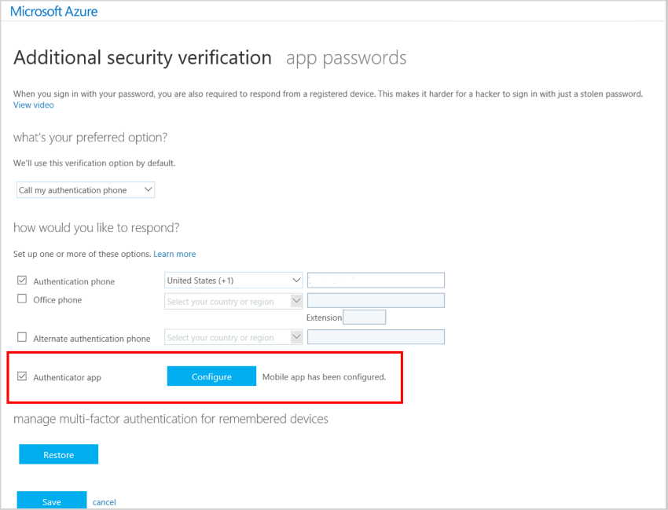
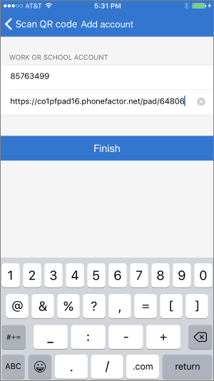

# Get started with the Microsoft Authenticator app

The Microsoft Authenticator app help prevent unauthorized access to accounts and to stop fraudulent transactions by giving you an additional level of security for your work or school account (for example, alain@contoso.com) or your personal Microsoft account (for example, alain@outlook.com).

When using the app for two-step verification, it can work in one of two ways:

- **Notification.** The app sends a notification to your device. Make sure the notification is right, and then select **Verify**. If you don’t recognize the notification, select **Deny**.

- **Verification code.** After you type your username and password, you can open the app and copy the verification code provided on the **Accounts** screen on to the sign-in screen. The verification code acts as a second form of authentication.

## Opt in for two-step verification

Your organization decides whether you use two-step verification with your work or school account. Your administrator will let you know which verification methods need to be set up and used. For more information, see [What does Azure Multi-Factor Authentication mean for me](multi-factor-authentication-end-user.md).

For your personal Microsoft account, you can set up two-step verification for yourself. For more detailed information and instructions, see [About two-step verification](https://support.microsoft.com/help/12408/microsoft-account-about-two-step-verification).

You can also use the Microsoft Authenticator app with non-Microsoft accounts. Those accounts might call the feature something other than two-step verification, but you should be able to find it within the security or sign-in settings. For more information, about how to set up these non-Microsoft accounts, see the [Microsoft Customer Support videos](https://www.youtube.com/playlist?list=PLyhj1WZ29G65QdD9NxTOAm8HwOS-OBUrX).

## Install the app

The Microsoft Authenticator app is available for [Android](https://go.microsoft.com/fwlink/?linkid=866594), [iOS](https://go.microsoft.com/fwlink/?linkid=866594), and [Windows Phone](http://go.microsoft.com/fwlink/?Linkid=825071). To get the best experience, you should let the app get notifications when you're asked. 

## Add accounts to the app

You can add work or school accounts or personal accounts to the Microsoft Authenticator app. 

### Add a personal Microsoft account

For a personal Microsoft account (one that you use to sign in to Outlook.com, Xbox, Skype, etc.), all you have to do is sign in to your account in the Microsoft Authenticator app.

### Add a work or school account

1. If possible, go to the [Additional security verification](http://aka.ms/mfasetup) screen on another PC or device. For information about how to get to this screen, see [Changing your security settings](multi-factor-authentication-end-user-manage-settings.md#where-to-find-the-settings-page) or contact your administrator.

    >[!Note]
    >If your administrator has turned on the security info preview experience, you can follow the instructions in the [Set up security info to use an authenticator app](security-info-setup-auth-app.md) section.

2. Check the box next to **Authenticator app**, and then select **Configure**.

    

    The **Configure mobile app** screen appears with a QR code for you to scan with the authenticator app.

    

3. Open the Microsoft Authenticator app. On the **Accounts** screen, select **Add account**, and then select **Work or school account**.

4. Use your device's camera to scan the QR code, and then select **Done** to close the QR code screen.

    >[!Note]
    >If your camera isn't working properly, you can [enter the QR code and URL manually](#add-an-account-to-the-app-manually).

    The **Accounts** screen of the app shows you your account name and a six-digit verification code. For additional security, the verification code changes every 30 seconds preventing you from using the same code twice.  

    

### Add an account to the app manually

1. Go to the **Additional security verification** screen. For information on how to get to this screen, see [Changing your security settings](multi-factor-authentication-end-user-manage-settings.md#where-to-find-the-settings-page).

2. Check the box next to **Authenticator app**, and then select **Configure**.

    The **Configure mobile app** screen appears.

3. Copy the code and URL information from the **Configure mobile app** screen so you can manually type them into the QR scanner.

4. Open the Microsoft Authenticator app. On the **Accounts** screen, select **Add account**, and then select **Work or school account**.

5. In the QR scanner screen, select **Enter code manually**.

    
   
6. Type the code and URL from the screen with the QR code into the **Add an account** screen, and then select **Finish**.

    

    The **Accounts** screen of the app shows you your account name and a six-digit verification code. For additional security, the verification code changes every 30 seconds preventing you from using the same code twice.

### Using your device's fingerprint or facial recognition capabilities

Your organization might require a PIN to complete your identity verification. You can set up the Microsoft Authenticator app to use your device's fingerprint or facial recognition capabilities instead of a PIN. You can set this up the first time you use the authenticator app to verify your account, by selecting the option to use your device biometric capabilities as identification instead of your PIN.

## Use the app when you sign in

After you add your accounts to the app, you can use the app to sign in to your accounts.

If you chose to use verification codes in the app, you'll start to see them on the **Accounts** page. The codes change every 30 seconds so that you always have a new code when you need one. But you don't need to do anything with them until you sign in and are prompted to enter a verification code.

## Next steps

- If you have more general questions about the app, see [Microsoft Authenticator FAQs](microsoft-authenticator-app-faq.md)

- If you want more information about two-step verification, see [Set up my account for two-step verification](multi-factor-authentication-end-user-first-time.md)

- If you want more information about security info, see [Manage your security info](security-info-manage-settings.md)
