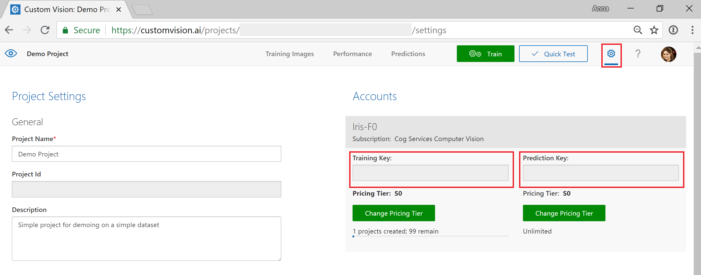

# Use Custom Vision API to build an image classification project with Java

Learn how to create an image classification project with the Custom Vision Service using Java. After it's created, you can add tags, upload images, train the project, get the project's default prediction endpoint URL, and use it to programmatically test an image. Use this open-source example as a template for building your own app by using the Custom Vision API.

## Prerequisites

- JDK 7 or 8 installed.
- Maven installed.

## Get the training and prediction keys

To get the keys used in this example, visit the [Custom Vision web page](https://customvision.ai) and select the __gear icon__ in the upper right. In the __Accounts__ section, copy the values from the __Training Key__ and __Prediction Key__ fields.



## Install the Custom Vision Service SDK

You can install the Custom Vision SDK from maven central repository:
* [Training SDK](https://mvnrepository.com/artifact/com.microsoft.azure.cognitiveservices/azure-cognitiveservices-customvision-training)
* [Prediction SDK](https://mvnrepository.com/artifact/com.microsoft.azure.cognitiveservices/azure-cognitiveservices-customvision-prediction)

## Understand the code

The full project, including images, is available from the [Custom Vision Azure samples for Java repository](https://github.com/Azure-Samples/cognitive-services-java-sdk-samples/tree/master). 

Use your favorite Java IDE to open the `Vision/CustomVision` project. 

This application uses the training key you retrieved earlier to create a new project named __Sample Java Project__. It then uploads images to train and test a classifier. The classifier identifies whether a tree is a __Hemlock__ or a __Japanese Cherry__.

The following code snippets implement the primary functionality of this example:

## Create a Custom Vision Service project

> [!IMPORTANT]
> Set the `trainingApiKey` to the training key value you retrieved earlier.

```java
final String trainingApiKey = "insert your training key here";
TrainingApi trainClient = CustomVisionTrainingManager.authenticate(trainingApiKey);

Trainings trainer = trainClient.trainings();

System.out.println("Creating project...");
Project project = trainer.createProject()
            .withName("Sample Java Project")
            .execute();
```

## Add tags to your project

```java
// create hemlock tag
Tag hemlockTag = trainer.createTag()
    .withProjectId(project.id())
    .withName("Hemlock")
    .execute();

// create cherry tag
Tag cherryTag = trainer.createTag()
    .withProjectId(project.id())
    .withName("Japanese Cherry")
    .execute();
```

## Upload images to the project

The sample is setup to include the images in the final package. Images are read from the resources section of the jar and uploaded to the service.

```java
System.out.println("Adding images...");
for (int i = 1; i <= 10; i++) {
    String fileName = "hemlock_" + i + ".jpg";
    byte[] contents = GetImage("/Hemlock", fileName);
    AddImageToProject(trainer, project, fileName, contents, hemlockTag.id(), null);
}

for (int i = 1; i <= 10; i++) {
    String fileName = "japanese_cherry_" + i + ".jpg";
    byte[] contents = GetImage("/Japanese Cherry", fileName);
    AddImageToProject(trainer, project, fileName, contents, cherryTag.id(), null);
}
```

The previous snippet code makes use of two helper functions that retrieve the images as resource streams and upload them to the service.

```java
private static void AddImageToProject(Trainings trainer, Project project, String fileName, byte[] contents, UUID tag)
{
    System.out.println("Adding image: " + fileName);

    ImageFileCreateEntry file = new ImageFileCreateEntry()
        .withName(fileName)
        .withContents(contents);

    ImageFileCreateBatch batch = new ImageFileCreateBatch()
        .withImages(Collections.singletonList(file));

    batch = batch.withTagIds(Collections.singletonList(tag));

    trainer.createImagesFromFiles(project.id(), batch);
}

private static byte[] GetImage(String folder, String fileName)
{
    try {
        return ByteStreams.toByteArray(CustomVisionSamples.class.getResourceAsStream(folder + "/" + fileName));
    } catch (Exception e) {
        System.out.println(e.getMessage());
        e.printStackTrace();
    }

    return null;
}
```

## Train the project

This creates the first iteration in the project and marks this iteration as the default iteration. 

```java
System.out.println("Training...");
Iteration iteration = trainer.trainProject(project.id());

while (iteration.status().equals("Training"))
{
    System.out.println("Training Status: "+ iteration.status());
    Thread.sleep(1000);
    iteration = trainer.getIteration(project.id(), iteration.id());
}

System.out.println("Training Status: "+ iteration.status());
trainer.updateIteration(project.id(), iteration.id(), iteration.withIsDefault(true));
```

## Get and use the default prediction endpoint

> [!IMPORTANT]
> Set the `predictionApiKey` to the prediction key value you retrieved earlier.

```java
final String predictionApiKey = "insert your prediction key here";
PredictionEndpoint predictClient = CustomVisionPredictionManager.authenticate(predictionApiKey);

// Use below for predictions from a url
// String url = "some url";
// ImagePrediction results = predictor.predictions().predictImage()
//                         .withProjectId(project.id())
//                         .withUrl(url)
//                         .execute();

// load test image
byte[] testImage = GetImage("/Test", "test_image.jpg");

// predict
ImagePrediction results = predictor.predictions().predictImage()
    .withProjectId(project.id())
    .withImageData(testImage)
    .execute();

for (Prediction prediction: results.predictions())
{
    System.out.println(String.format("\t%s: %.2f%%", prediction.tagName(), prediction.probability() * 100.0f));
}
```

## Run the example

To compile and run the solution using maven:

```
mvn compile exec:java
```

The output of the application is similar to the following text:

```
Creating project...
Adding images...
Adding image: hemlock_1.jpg
Adding image: hemlock_2.jpg
Adding image: hemlock_3.jpg
Adding image: hemlock_4.jpg
Adding image: hemlock_5.jpg
Adding image: hemlock_6.jpg
Adding image: hemlock_7.jpg
Adding image: hemlock_8.jpg
Adding image: hemlock_9.jpg
Adding image: hemlock_10.jpg
Adding image: japanese_cherry_1.jpg
Adding image: japanese_cherry_2.jpg
Adding image: japanese_cherry_3.jpg
Adding image: japanese_cherry_4.jpg
Adding image: japanese_cherry_5.jpg
Adding image: japanese_cherry_6.jpg
Adding image: japanese_cherry_7.jpg
Adding image: japanese_cherry_8.jpg
Adding image: japanese_cherry_9.jpg
Adding image: japanese_cherry_10.jpg
Training...
Training status: Training
Training status: Training
Training status: Completed
Done!
        Hemlock: 93.53%
        Japanese Cherry: 0.01%
```