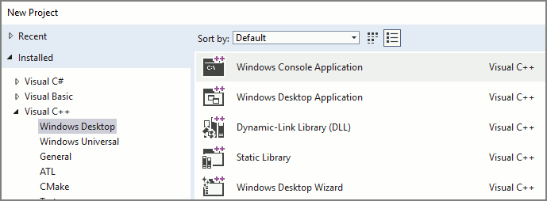
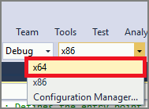
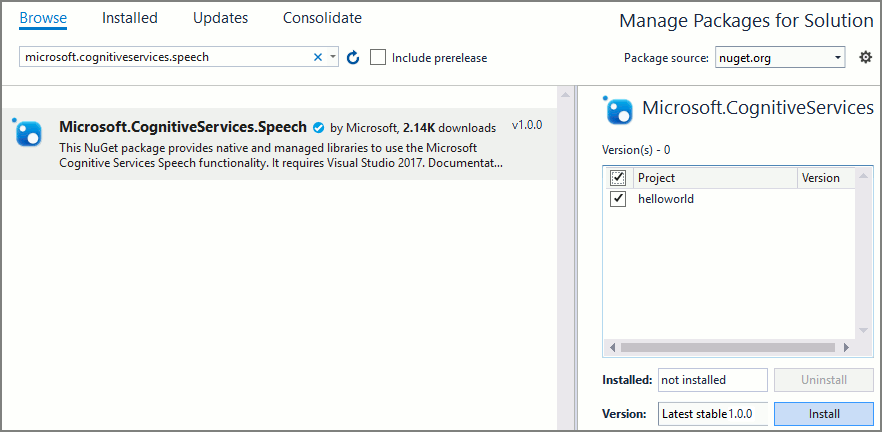
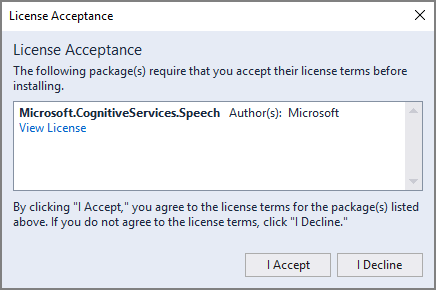
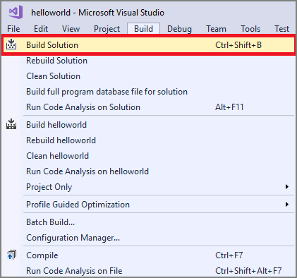
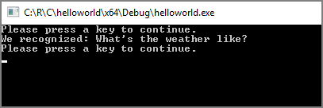

# Quickstart: Recognize speech in C++ on Windows by using the Speech SDK

[!INCLUDE [Selector](../../../includes/cognitive-services-speech-service-quickstart-selector.md)]

In this article, you create a C++ console application for Windows. You use the Cognitive Services [Speech SDK](speech-sdk.md) to transcribe speech to text in real time from your PC's microphone. The application is built with the [Speech SDK NuGet package](https://aka.ms/csspeech/nuget) and Microsoft Visual Studio 2017 (any edition).

## Prerequisites

You need a Speech service subscription key to complete this Quickstart. You can get one for free. See [Try the Speech service for free](get-started.md) for details.

## Create a Visual Studio project

1. Start Visual Studio 2017.

1. Make sure the **Desktop development with C++** workload is available. Choose **Tools** > **Get Tools and Features** from the Visual Studio menu bar to open the Visual Studio installer. If this workload is already enabled, skip to the next step. 

    

    Otherwise, check the box next to **Desktop development with C++**. 

1. Make sure the **NuGet package manager** component is available. Switch to the **Individual components** tab of the Visual Studio installer dialog box, and select **NuGet package manager** if it is not already enabled.

      

1. If you needed to enable either the C++ workload or NuGet, select **Modify** (at the lower right corner of the dialog box). Installation of the new features takes a moment. If both features were already enabled, close the dialog box instead.

1. Create a new Visual C++ Windows Desktop Windows Console Application. First, choose **File** > **New** > **Project** from the menu. In the **New Project** dialog box, expand **Installed** > **Visual C++** > **Windows Desktop** in the left pane. Then select **Windows Console Application**. For the project name, enter *helloworld*.

    

1. If you're running 64-bit Windows, you may switch your build platform to `x64` by using the drop-down menu in the Visual Studio toolbar. (64-bit versions of Windows can run 32-bit applications, so this is not a requirement.)

    

1. In Solution Explorer, right-click the solution and choose **Manage NuGet Packages for Solution**.

    

1. In the upper-right corner, in the **Package Source** field, select **nuget.org**. Search for the `Microsoft.CognitiveServices.Speech` package, and install it into the **helloworld** project.

    

    > [!NOTE]
    > The current version of the Cognitive Services Speech SDK is `1.0.0`.

1. Accept the displayed license to begin installation of the NuGet package.

    

After the package is installed, a confirmation appears in the Package Manager console.

## Add sample code

1. Open the source file *helloworld.cpp*. Replace all the code below the initial include statement (`#include "stdafx.h"` or `#include "pch.h"`) with the following:

   [!code-cpp[Quickstart Code](~/samples-cognitive-services-speech-sdk/quickstart/cpp-windows/helloworld/helloworld.cpp#code)]

1. In the same file, replace the string `YourSubscriptionKey` with your subscription key.

1. Replace the string `YourServiceRegion` with the [region](regions.md) associated with your subscription (for example, `westus` for the free trial subscription).

1. Save changes to the project.

## Build and run the app

1. Build the application. From the menu bar, choose **Build** > **Build Solution**. The code should compile without errors.

   

1. Start the application. From the menu bar, choose **Debug** > **Start Debugging**, or press **F5**.

   

1. A console window appears, prompting you to say something. Speak an English phrase or sentence. Your speech is transmitted to the Speech service and transcribed to text, which appears in the same window.

   

[!INCLUDE [Download this sample](../../../includes/cognitive-services-speech-service-speech-sdk-sample-download-h2.md)]
Look for this sample in the `quickstart/cpp-windows` folder.

## Next steps

> [!div class="nextstepaction"]
> [Recognize intents from speech by using the Speech SDK for C++](how-to-recognize-intents-from-speech-cpp.md)

## See also

- [Translate speech](how-to-translate-speech-csharp.md)
- [Customize acoustic models](how-to-customize-acoustic-models.md)
- [Customize language models](how-to-customize-language-model.md)
