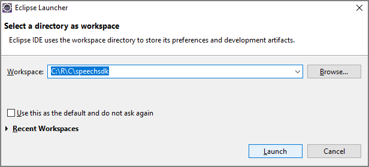
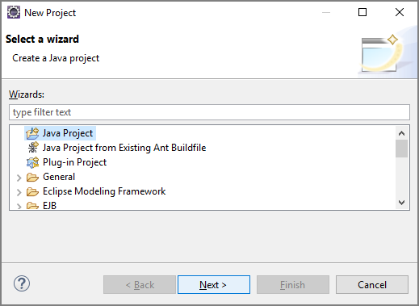
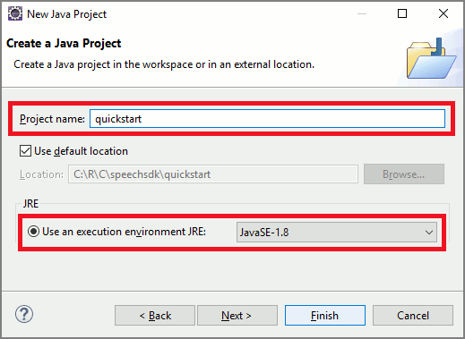
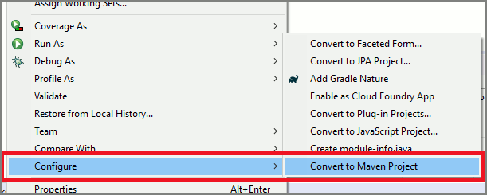
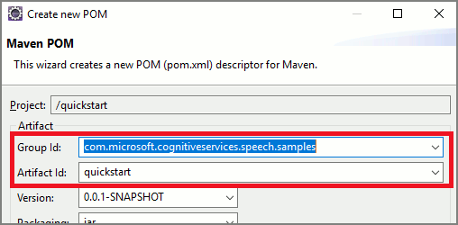
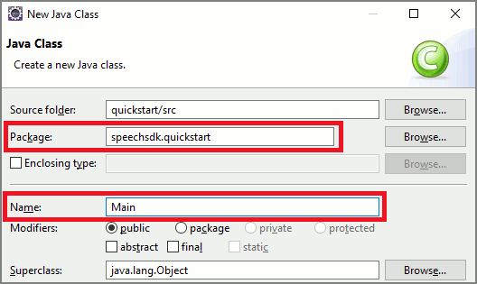

# Quickstart: Recognize speech in Java on Windows or Linux by using the Speech SDK

[!INCLUDE [Selector](../../../includes/cognitive-services-speech-service-quickstart-selector.md)]

In this article, you create a Java console application by using the [Speech SDK](speech-sdk.md). You transcribe speech to text in real time from your PC's microphone. The application is built with the Speech SDK Maven package, and the Eclipse Java IDE (v4.8) on 64-bit Windows or Ubuntu Linux 16.04. It runs on a 64-bit Java 8 runtime environment (JRE).

> [!NOTE]
> For the Speech Devices SDK and the Roobo device, see [Speech Devices SDK](speech-devices-sdk.md).

## Prerequisites

You need a Speech service subscription key to complete this Quickstart. You can get one for free. See [Try the Speech service for free](get-started.md) for details.


## Create and configure project

If you are using Ubuntu 16.04, before starting Eclipse, run the following commands to make sure that required packages are installed.

  ```sh
  sudo apt-get update
  sudo apt-get install build-essential libssl1.0.0 libcurl3 libasound2 wget
  ```

1. Start Eclipse.

1. In the Eclipse Launcher, in the **Workspace** field, enter the name of a new workspace directory. Then select **Launch**.

   

1. In a moment, the main window of the Eclipse IDE appears. Close the Welcome screen if one is present.

1. From the Eclipse menu bar, create a new project by choosing **File** > **New** > **Project**.

1. The **New Project** dialog box appears. Select **Java Project**, and select **Next**.

   

1. The New Java Project wizard starts. In the **Project name** field, enter **quickstart**, and choose **JavaSE-1.8** as the execution environment. Select **Finish**.

   

1. If the **Open Associated Perspective?** window appears, select **Open Perspective**.

1. In the **Package explorer**, right-click the **quickstart** project. Choose **Configure** > **Convert to Maven Project** from the context menu.

   

1. The **Create new POM** window appears. In the **Group Id** field, enter **com.microsoft.cognitiveservices.speech.samples**, and in the **Artifact Id** field, enter  **quickstart**. Then select **Finish**.

   

1. Open the **pom.xml** file and edit it.

   * At the end of the file, before the closing tag `</project>`, create a `repositories` element with a reference to the Maven repository for the Speech SDK, as shown here:

     [!code-xml[POM Repositories](~/samples-cognitive-services-speech-sdk/quickstart/java-jre/pom.xml#repositories)]

  * Also add a `dependencies` element, with the Speech SDK version 1.0.0 as a dependency:

     [!code-xml[POM Dependencies](~/samples-cognitive-services-speech-sdk/quickstart/java-jre/pom.xml#dependencies)]

   * Save the changes.

## Add sample code

1. To add a new empty class to your Java project, select **File** > **New** > **Class**.

1. In the **New Java Class** window, enter **speechsdk.quickstart** into the **Package** field, and **Main** into the **Name** field.

   

1. Replace all code in `Main.java` with the following snippet:

   [!code-java[Quickstart Code](~/samples-cognitive-services-speech-sdk/quickstart/java-jre/src/speechsdk/quickstart/Main.java#code)]

1. Replace the string `YourSubscriptionKey` with your subscription key.

1. Replace the string `YourServiceRegion` with the [region](regions.md) associated with your subscription (for example, `westus` for the free trial subscription).

1. Save changes to the project.

## Build and run the app

Press F11, or select **Run** > **Debug**.
The next 15 seconds of speech input from your microphone will be recognized and logged in the console window.


[!INCLUDE [Download this sample](../../../includes/cognitive-services-speech-service-speech-sdk-sample-download-h2.md)]
Look for this sample in the `quickstart/java-jre` folder.

## Next steps

> [!div class="nextstepaction"]
> [Recognize intents from speech by using the Speech SDK for Java](how-to-recognize-intents-from-speech-java.md)

## See also

- [Translate speech](how-to-translate-speech-csharp.md)
- [Customize acoustic models](how-to-customize-acoustic-models.md)
- [Customize language models](how-to-customize-language-model.md)
