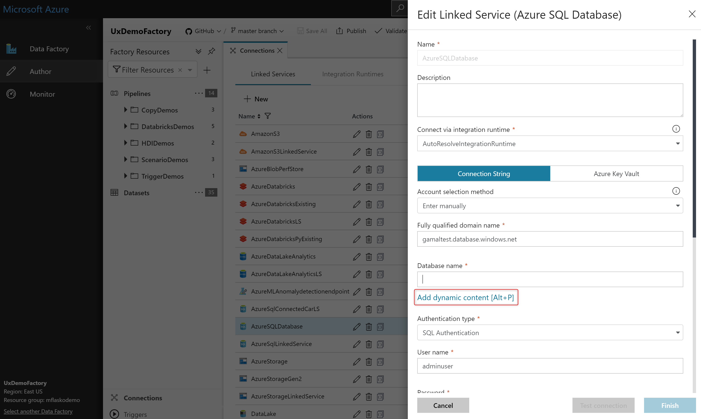
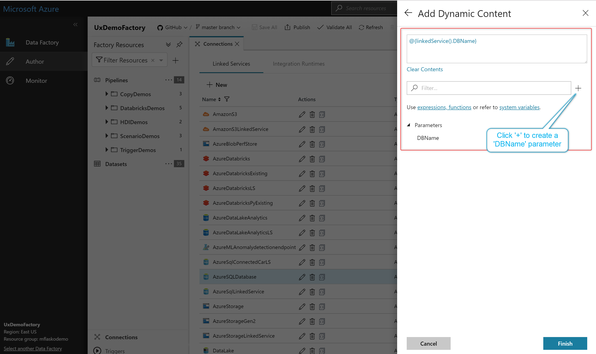

---
title: Parameterize linked services in Azure Data Factory | Microsoft Docs
description: Learn how to parameterize linked services in Azure Data Factory and pass dynamic values at run time.
services: data-factory
documentationcenter: ''
author: douglaslMS
manager: craigg
ms.service: data-factory
ms.workload: data-services
ms.tgt_pltfrm: na
ms.devlang: na
ms.topic: conceptual
ms.date: 08/31/2018
ms.author: douglasl
---
# Parameterize linked services in Azure Data Factory

You can now parameterize a linked service and pass dynamic values at run time. For example, if you want to connect to different databases on the same Azure SQL Database server, you can now parameterize the database name in the linked service definition. This prevents you from having to create a linked service for each database on the Azure SQL database server. You can parameterize other properties in the linked service definition as well - for example, *User name.*

You can use the Data Factory UI in the Azure Portal or a programming interface to parameterize linked services.

> [!TIP]
> We recommend not to parameterize passwords or secrets. Store all connection strings in Azure Key Vault instead, and parameterize the *Secret Name*.

## Data Factory UI





## JSON

```json
{
	"name": "AzureSqlDatabase",
	"properties": {
		"type": "AzureSqlDatabase",
		"typeProperties": {
			"connectionString": {
				"value": "Server=tcp:myserver.database.windows.net,1433;Database=@{linkedService().DBName};User ID=user;Password=fake;Trusted_Connection=False;Encrypt=True;Connection Timeout=30",
				"type": "SecureString"
			}
		},
		"connectVia": null,
		"parameters": {
			"DBName": {
				"type": "String"
			}
		}
	}
}
```
