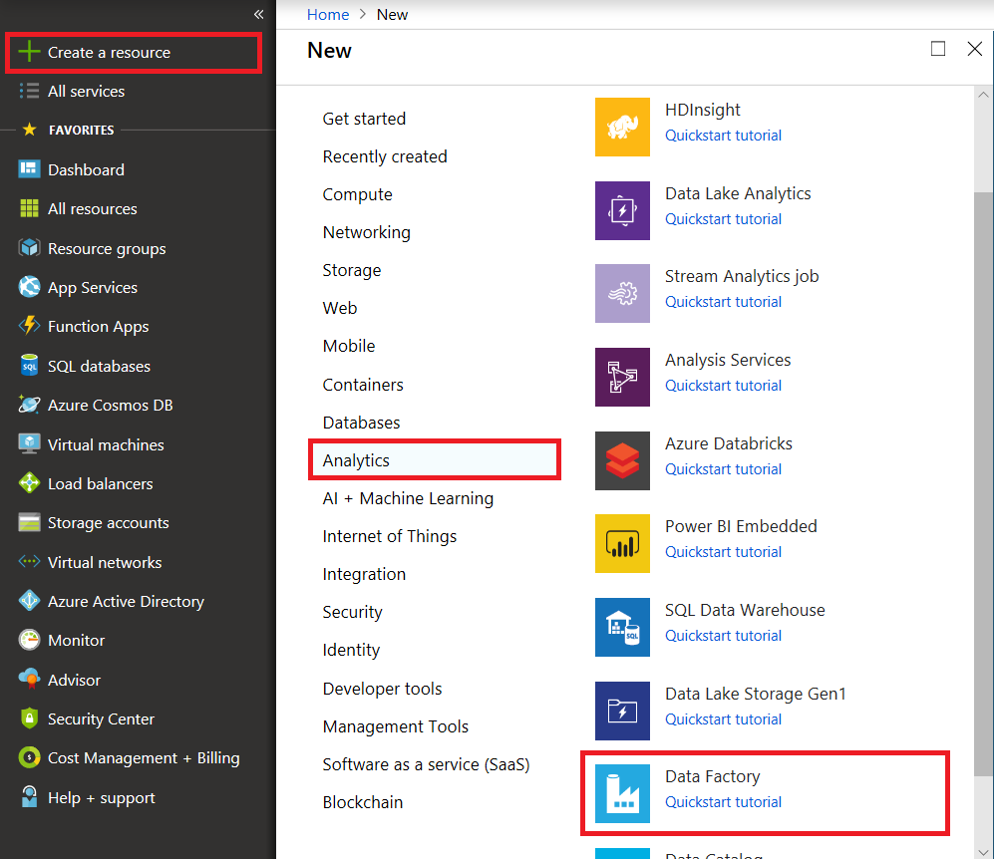
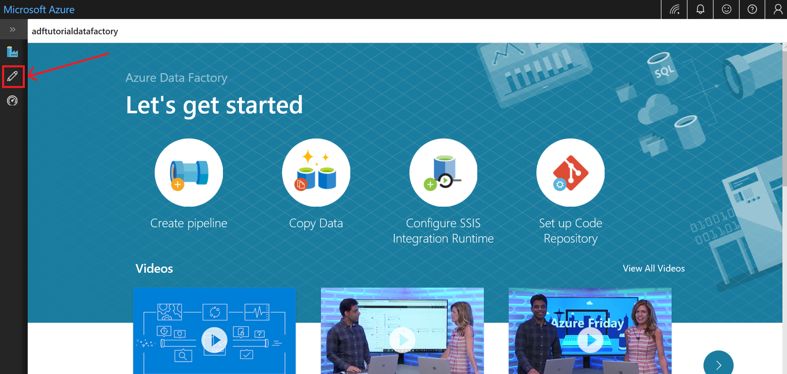
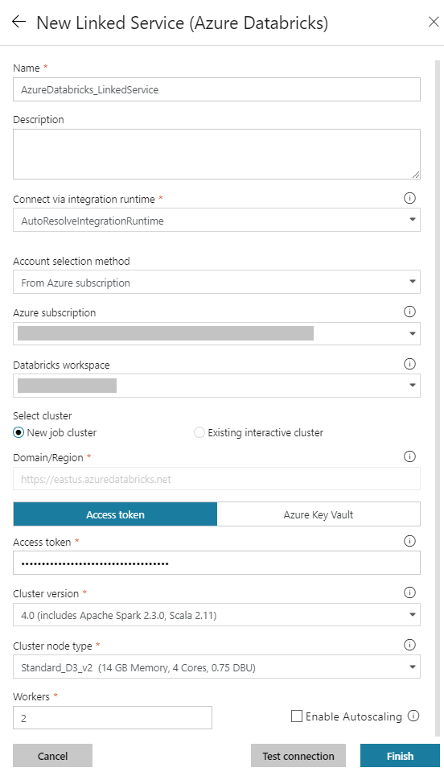
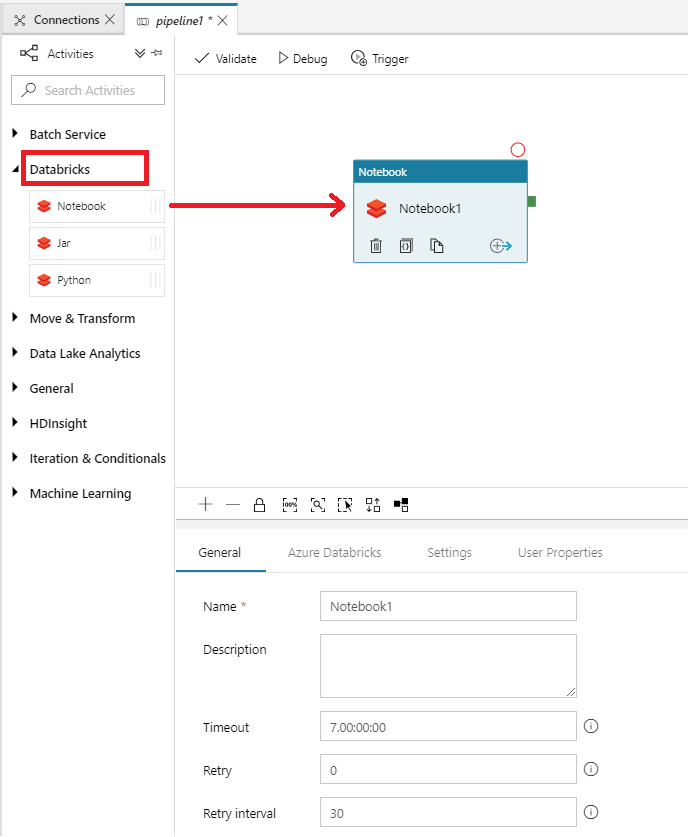
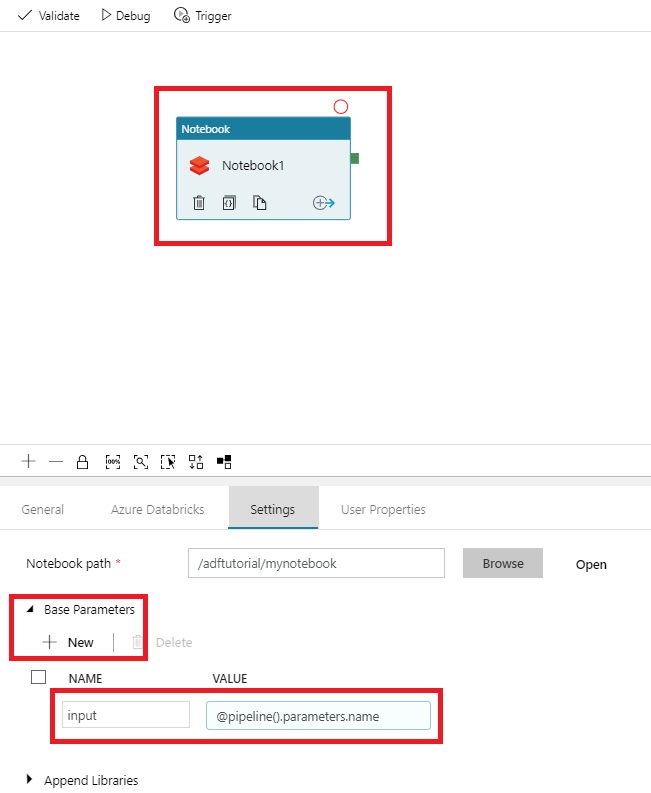
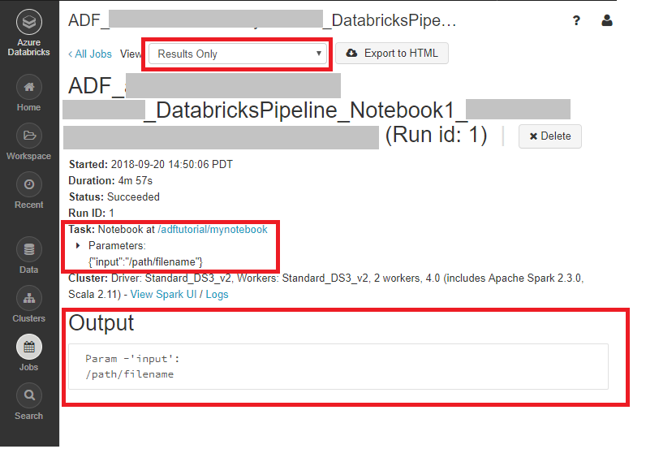

---
title: "Run a Databricks Notebook with the Databricks Notebook activity in Azure Data Factory"
description: "Learn how you can use the Databricks Notebook Activity in an Azure data factory to run a Databricks notebook against the databricks jobs cluster."
services: data-factory
documentationcenter: ""
author: nabhishek 
manager: craigg

ms.service: data-factory
ms.workload: data-services
ms.tgt_pltfrm: na
ms.devlang: na
ms.topic: tutorial
ms.date: "03/12/2018"
ms.author: abnarain
ms.reviewer: douglasl
---
# Run a Databricks notebook with the Databricks Notebook Activity in Azure Data Factory

In this tutorial, you use the Azure portal to create an Azure Data Factory pipeline that executes a Databricks notebook against the Databricks jobs cluster. It also passes Azure Data Factory parameters to the Databricks notebook during execution.

You perform the following steps in this tutorial:

  - Create a data factory.

  - Create a pipeline that uses Databricks Notebook Activity.

  - Trigger a pipeline run.

  - Monitor the pipeline run.

If you don't have an Azure subscription, create a [free account](https://azure.microsoft.com/free/) before you begin.

For an eleven-minute introduction and demonstration of this feature, watch the following video:

> [!VIDEO https://channel9.msdn.com/Shows/Azure-Friday/ingest-prepare-and-transform-using-azure-databricks-and-data-factory/player]

## Prerequisites

  - **Azure Databricks workspace**. [Create a Databricks workspace](https://docs.microsoft.com/azure/azure-databricks/quickstart-create-databricks-workspace-portal) or use an existing one. You create a Python notebook in your Azure Databricks workspace. Then you execute the notebook and pass parameters to it using Azure Data Factory.

## Create a data factory

1.  Launch **Microsoft Edge** or **Google Chrome** web browser. Currently, Data Factory UI is supported only in Microsoft Edge and Google Chrome web browsers.

1.  Select **Create a resource** on the left menu, select **Analytics**, and then select **Data Factory**.

    

1.  In the **New data factory** pane, enter **ADFTutorialDataFactory** under **Name**.

    The name of the Azure data factory must be *globally unique*. If you see the following error, change the name of the data factory. (For example, use **\<yourname\>ADFTutorialDataFactory**). For naming rules for Data Factory artifacts, see the [Data Factory - naming rules](https://docs.microsoft.com/azure/data-factory/naming-rules) article.

    

1.  For **Subscription**, select your Azure subscription in which you want to create the data factory.

1.  For **Resource Group**, take one of the following steps:
    
    - Select **Use existing** and select an existing resource group from the drop-down list.
    
    - Select **Create new** and enter the name of a resource group.

    Some of the steps in this quickstart assume that you use the name **ADFTutorialResourceGroup** for the resource group. To learn about resource groups, see [Using resource groups to manage your Azure resources](https://docs.microsoft.com/azure/azure-resource-manager/resource-group-overview).

1.  For **Version**, select **V2**.

1.  For **Location**, select the location for the data factory.

    For a list of Azure regions in which Data Factory is currently available, select the regions that interest you on the following page, and then expand **Analytics** to locate **Data Factory**: [Products available by region](https://azure.microsoft.com/global-infrastructure/services/). The data stores (like Azure Storage and Azure SQL Database) and computes (like HDInsight) that Data Factory uses can be in other regions.
1.  Select **Create**.


1.  After the creation is complete, you see the **Data factory** page. Select the **Author & Monitor** tile to start the Data Factory UI application on a separate tab.

    

## Create linked services

In this section, you author a Databricks linked service. This linked service contains the connection information to the Databricks cluster:

### Create an Azure Databricks linked service

1.  On the **Let's get started** page, switch to the **Edit** tab in the left panel.

    

1.  Select **Connections** at the bottom of the window, and then select **+ New**.
    
    

1.  In the **New Linked Service** window, select **Compute** \> **Azure Databricks**, and then select **Continue**.
    
    

1.  In the **New Linked Service** window, complete the following steps:
    
    1.  For **Name**, enter ***AzureDatabricks\_LinkedService***
    
    1.  Select the appropriate **Databricks workspace** that you will run your notebook in

    1.  For **Select cluster**, select **New job cluster**
    
    1.  For **Domain/ Region**, info should auto-populate

    1.  For **Access Token**, generate it from Azure Databricks workplace. You can find the steps [here](https://docs.databricks.com/api/latest/authentication.html#generate-token).

    1.  For **Cluster version**, select **4.0** (with Apache Spark 2.3.0, Scala 2.11)

    1.  For **Cluster node type**, select **Standard\_D3\_v2** under **General Purpose (HDD)** category for this tutorial. 
    
    1.  For **Workers**, enter **2**.
    
    1.  Select **Finish**

        

## Create a pipeline

1.  Select the **+** (plus) button, and then select **Pipeline** on the menu.

    

1.  Create a **parameter** to be used in the **Pipeline**. Later you pass this parameter to the Databricks Notebook Activity. In the empty pipeline, click on the **Parameters** tab, then **New** and name it as '**name**'.

    

    

1.  In the **Activities** toolbox, expand **Databricks**. Drag the **Notebook** activity from the **Activities** toolbox to the pipeline designer surface.

    

1.  In the properties for the **Databricks** **Notebook** activity window at the bottom, complete the following steps:

    a. Switch to the **Azure Databricks** tab.

    b. Select **AzureDatabricks\_LinkedService** (which you created in the previous procedure).

    c. Switch to the **Settings** tab

    c. Browse to select a Databricks **Notebook path**. Let’s create a notebook and specify the path here. You get the Notebook Path by following the next few steps.

       1. Launch your Azure Databricks Workspace

       1. Create a **New Folder** in Workplace and call it as **adftutorial**.

          

       1. [Create a new notebook](https://docs.databricks.com/user-guide/notebooks/index.html#creating-a-notebook) (Python), let’s call it **mynotebook** under **adftutorial** Folder**,** click **Create.**

          

          

       1. In the newly created notebook "mynotebook'" add the following code:

           ```
           # Creating widgets for leveraging parameters, and printing the parameters

           dbutils.widgets.text("input", "","")
           dbutils.widgets.get("input")
           y = getArgument("input")
           print "Param -\'input':"
           print y
           ```

           

       1. The **Notebook Path** in this case is **/adftutorial/mynotebook**

1.  Switch back to the **Data Factory UI authoring tool**. Navigate to **Settings** Tab under the **Notebook1 Activity**. 
    
    a.  **Add Parameter** to the Notebook activity. You use the same parameter that you added earlier to the **Pipeline**.

       

    b.  Name the parameter as **input** and provide the value as expression **@pipeline().parameters.name**.

1.  To validate the pipeline, select the **Validate** button on the toolbar. To close the validation window, select the **\>\>** (right arrow) button.

    

1.  Select **Publish All**. The Data Factory UI publishes entities (linked services and pipeline) to the Azure Data Factory service.

    

## Trigger a pipeline run

Select **Trigger** on the toolbar, and then select **Trigger Now**.


The **Pipeline Run** dialog box asks for the **name** parameter. Use **/path/filename** as the parameter here. Click **Finish.**


## Monitor the pipeline run

1.  Switch to the **Monitor** tab. Confirm that you see a pipeline run. It takes approximately 5-8 minutes to create a Databricks job cluster, where the notebook is executed.

    

1.  Select **Refresh** periodically to check the status of the pipeline run.

1.  To see activity runs associated with the pipeline run, select **View Activity Runs** in the **Actions** column.

    

You can switch back to the pipeline runs view by selecting the **Pipelines** link at the top.

## Verify the output

You can log on to the **Azure Databricks workspace**, go to **Clusters** and you can see the **Job** status as *pending execution, running, or terminated*.


You can click on the **Job name** and navigate to see further details. On successful run, you can validate the parameters passed and the output of the Python notebook.



## Next steps

The pipeline in this sample triggers a Databricks Notebook activity and passes a parameter to it. You learned how to:

  - Create a data factory.

  - Create a pipeline that uses a Databricks Notebook activity.

  - Trigger a pipeline run.

  - Monitor the pipeline run.
