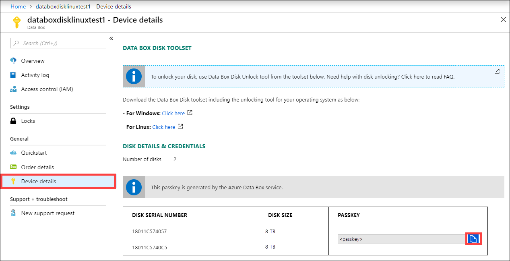
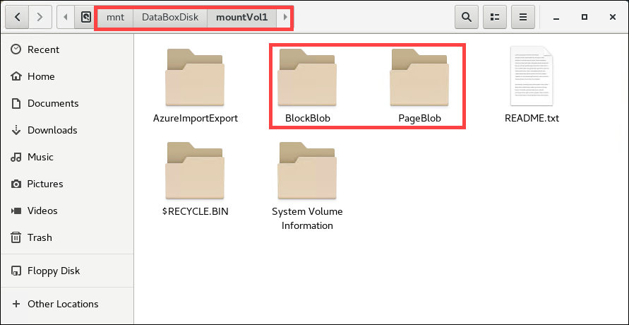

# Tutorial: Unpack, connect, and unlock Azure Data Box Disk

This tutorial describes how to unpack, connect, and unlock your Azure Data Box Disk.

In this tutorial, you learn how to:

> [!div class="checklist"]
> * Unpack your Data Box Disk
> * Connect to disks and get the passkey
> * Unlock disks on Windows client
> * Unlock disks on Linux client

## Prerequisites

Before you begin, make sure that:

1. You have completed the [Tutorial: Order Azure Data Box Disk](data-box-disk-deploy-ordered.md).
2. You have received your disks and the job status in the portal is updated to **Delivered**.
3. You have a client computer on which you can install the Data Box Disk unlock tool. Your client computer must:
    - Run a [Supported operating system](data-box-disk-system-requirements.md#supported-operating-systems-for-clients).
    - Have other [required software](data-box-disk-system-requirements.md#other-required-software-for-windows-clients) installed if it is a Windows client.  

## Unpack your disks

 Perform the following steps to unpack your disks.

1. The Data Box Disks are mailed in a small shipping Box. Open the box and remove its contents. Check that the box has 1 to 5 solid-state disks (SSDs) and a USB connecting cable per disk. Inspect the box for any evidence of tampering, or any other obvious damage. 

    

2. If the shipping box is tampered or severely damaged, do not open the box. Contact Microsoft Support to help you assess whether the disks are in good working order and if they need to ship you a replacement.
3. Verify that the box has a clear sleeve containing a shipping label (under the current label) for return shipment. If this label is lost or damaged, you can always download and print a new one from the Azure portal. 

    

4. Save the box and packaging foam for return shipment of the disks.

## Connect to disks and get the passkey 

1. Use the included cable to connect the disk to the client computer running a supported OS as stated in the prerequisites. 

        
    
2. In the Azure portal, go to **General > Device details**. Use the copy icon to copy the passkey. This passkey will be used to unlock the disks.

     

Depending on whether you are connected to a Windows or Linux client, the steps to unlock the disks are different.

## Unlock disks on Windows client

Perform the following steps to connect and unlock your disks.
     
1. In the Azure portal, go to **General > Device details**. 
2. Download the Data Box Disk toolset corresponding to the Windows client. This toolset contains 3 tools: Data Box Disk Unlock tool, Data Box Disk Validation tool, and Data Box Disk Split Copy tool. 

    In this procedure, you will use only the Data Box Disk Unlock tool. The other two tools will be used later.

    > [!div class="nextstepaction"]
    > [Download Data Box Disk toolset for Windows](http://aka.ms/databoxdisktoolswin)         

3. Extract the toolset on the same computer that you will use to copy the data. 
4. Open a Command Prompt window or run Windows PowerShell as administrator on the same computer.
5. (Optional) To verify the computer that you are using to unlock the disk meets the operating system requirements, run the system check command. A sample output is shown below. 

    ```powershell
    Windows PowerShell
    Copyright (C) Microsoft Corporation. All rights reserved.
    
    PS C:\DataBoxDiskUnlockTool\DiskUnlock> .\DataBoxDiskUnlock.exe /SystemCheck
    Successfully verified that the system can run the tool.
    PS C:\DataBoxDiskUnlockTool\DiskUnlock>
    ``` 

6. Run `DataBoxDiskUnlock.exe` and supply the passkey you obtained in [Connect to disks and get the passkey](#Connect-to-disks-and-get-the-passkey). The drive letter assigned to the disk is displayed. A sample output is shown below.

    ```powershell
    PS C:\WINDOWS\system32> cd C:\DataBoxDiskUnlockTool\DiskUnlock
    PS C:\DataBoxDiskUnlockTool\DiskUnlock> .\DataBoxDiskUnlock.exe
    Enter the passkey :
    testpasskey1
    
    Following volumes are unlocked and verified.
    Volume drive letters: D:
    
    PS C:\DataBoxDiskUnlockTool\DiskUnlock>
    ```

7. Repeat the unlock steps for any future disk reinserts. Use the `help` command if you need help with the Data Box Disk unlock tool.   

    ```powershell
    PS C:\DataBoxDiskUnlockTool\DiskUnlock> .\DataBoxDiskUnlock.exe /help
    USAGE:
    DataBoxUnlock /PassKey:<passkey_from_Azure_portal>
    
    Example: DataBoxUnlock /PassKey:<your passkey>
    Example: DataBoxUnlock /SystemCheck
    Example: DataBoxUnlock /Help
    
    /PassKey:        Get this passkey from Azure DataBox Disk order. The passkey unlocks your disks.
    /SystemCheck:    This option checks if your system meets the requirements to run the tool.
    /Help:           This option provides help on cmdlet usage and examples.
    
    PS C:\DataBoxDiskUnlockTool\DiskUnlock>
    ```  
8. Once the disk is unlocked, you can view the contents of the disk.    

     

## Unlock disks on Linux client

1. In the Azure portal, go to **General > Device details**. 
2. Download the Data Box Disk toolset corresponding to the Linux client.  

    > [!div class="nextstepaction"]
    > [Download Data Box Disk toolset for Linux](http://aka.ms/databoxdisktoolslinux) 

3. On your Linux client, open a terminal. Navigate to the folder where you downloaded the software. Change the file permissions so that you can execute these files. Type the following command: 

    `chmod +x DataBoxDiskUnlock_x86_64` 
    
    `chmod +x DataBoxDiskUnlock_Prep.sh` 
 
    A sample output is shown below. Once the chmod command is run, you can verify that the file permissions are changed by running the `ls` command. 
 
    ```
        [user@localhost Downloads]$ chmod +x DataBoxDiskUnlock_x86_64  
        [user@localhost Downloads]$ chmod +x DataBoxDiskUnlock_Prep.sh   
        [user@localhost Downloads]$ ls -l  
        -rwxrwxr-x. 1 user user 1152664 Aug 10 17:26 DataBoxDiskUnlock_x86_64  
        -rwxrwxr-x. 1 user user 795 Aug 5 23:26 DataBoxDiskUnlock_Prep.sh
    ```
4. Execute the script so that it installs all the binaries needed for the Data Box Disk Unlock software. Use `sudo` to run the command as root. Once the binaries are successfully installed, you will see a note to that effect on the terminal.

    `sudo ./DataBoxDiskUnlock_Prep.sh`

    The script will first check whether your client computer is running a supported operating system. A sample output is shown below. 
 
    ```
    [user@localhost Documents]$ sudo ./DataBoxDiskUnlock_Prep.sh 
        OS = CentOS Version = 6.9 
        Release = CentOS release 6.9 (Final) 
        Architecture = x64 
    
        The script will install the following packages and dependencies. 
        epel-release 
        dislocker 
        ntfs-3g 
        fuse-dislocker 
        Do you wish to continue? y|n :|
    ```
    
 
5. Type `y` to continue the install. The packages that the script installs are: 
    - **epel-release** - Repository that contains the following three packages. 
    - **dislocker and fuse-dislocker** - This utility helps decrypting BitLocker encrypted disks. 
    - **ntfs-3g** - Package that helps mount NTFS volumes. 
 
    Once the packages are successfully installed, the terminal will display a notification to that effect.     
    ```
    Dependency Installed: compat-readline5.x86 64 0:5.2-17.I.el6 dislocker-libs.x86 64 0:0.7.1-8.el6 mbedtls.x86 64 0:2.7.4-l.el6        ruby.x86 64 0:1.8.7.374-5.el6 
    ruby-libs.x86 64 0:1.8.7.374-5.el6 
    Complete! 
    Loaded plugins: fastestmirror, refresh-packagekit, security 
    Setting up Remove Process 
    Resolving Dependencies 
    --> Running transaction check 
    ---> Package epel-release.noarch 0:6-8 will be erased --> Finished Dependency Resolution 
    Dependencies Resolved 
    Package        Architecture        Version        Repository        Size 
    Removing:  epel-release        noarch         6-8        @extras        22 k 
    Transaction Summary                                 
    Remove        1 Package(s) 
    Installed size: 22 k 
    Downloading Packages: 
    Running rpmcheckdebug 
    Running Transaction Test 
    Transaction Test Succeeded 
    Running Transaction 
    Erasing : epel-release-6-8.noarch 
    Verifying : epel-release-6-8.noarch 
    Removed: 
    epel-release.noarch 0:6-8 
    Complete! 
    Dislocker is installed by the script. 
    OpenSSL is already installed.
    ```

6. Run the Data Box Disk Unlock tool. Supply the passkey from the Azure portal you obtained in [Connect to disks and get the passkey](#Connect-to-disks-and-get-the-passkey). Optionally specify a list of BitLocker encrypted volumes to unlock. The passkey and volume list should be specified within single quotes. 

    Type the following command.
 
    `sudo ./DataBoxDiskUnlock_x86_64 /PassKey:’<Your passkey from Azure portal>’ /Volumes:’<list of volumes>’`         

    The sample output is shown below. 
 
    ```
    [user@localhost Downloads]$ sudo ./DataBoxDiskUnlock_x86_64 /Passkey:’qwerqwerqwer’ /Volumes:’/dev/sdbl’ 
    
    START: Mon Aug 13 14:25:49 2018 
    Volumes: /dev/sdbl 
    Passkey: qwerqwerqwer 
    
    Volumes for data copy : 
    /dev/sdbl: /mnt/DataBoxDisk/mountVoll/ 
    END: Mon Aug 13 14:26:02 2018
    ```
    The mount point for the volume that you can copy your data to is displayed.

7. Repeat unlock steps for any future disk reinserts. Use the `help` command if you need help with the Data Box Disk unlock tool. 
    
    `sudo ./DataBoxDiskUnlock_x86_64 /Help` 

    The sample output is shown below. 
 
    ```
    [user@localhost Downloads]$ sudo ./DataBoxDiskUnlock_x86_64 /Help  
    START: Mon Aug 13 14:29:20 2018 
    USAGE: 
    sudo DataBoxDiskUnlock /PassKey:’<passkey from Azure_portal>’ 
    
    Example: sudo DataBoxDiskUnlock /PassKey:’passkey’ 
    Example: sudo DataBoxDiskUnlock /PassKey:’passkey’ /Volumes:’/dev/sdbl’ 
    Example: sudo DataBoxDiskUnlock /Help Example: sudo DataBoxDiskUnlock /Clean 
    
    /PassKey: This option takes a passkey as input and unlocks all of your disks. 
    Get the passkey from your Data Box Disk order in Azure portal. 
    /Volumes: This option is used to input a list of BitLocker encrypted volumes. 
    /Help: This option provides help on the tool usage and examples. 
    /Unmount: This option unmounts all the volumes mounted by this tool. 
   
    END: Mon Aug 13 14:29:20 2018 [user@localhost Downloads]$
    ```
    
8. Once the disk is unlocked, you can go to the mount point and view the contents of the disk. You are now ready to copy the data to *BlockBlob* or *PageBlob* folders. 

    

## Next steps

In this tutorial, you learned about Azure Data Box Disk topics such as:

> [!div class="checklist"]
> * Unpack your Data Box Disk
> * Connect to disks and get the passkey
> * Unlock disks on Windows client
> * Unlock disks on Linux client


Advance to the next tutorial to learn how to copy data on your Data Box Disk.

> [!div class="nextstepaction"]
> [Copy data on your Data Box Disk](./data-box-disk-deploy-copy-data.md)

