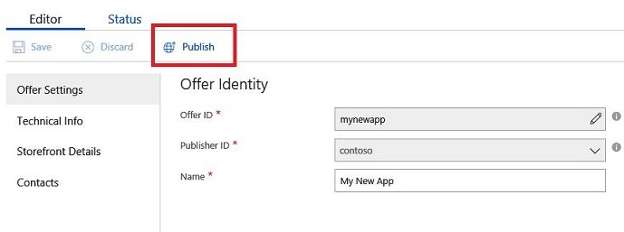
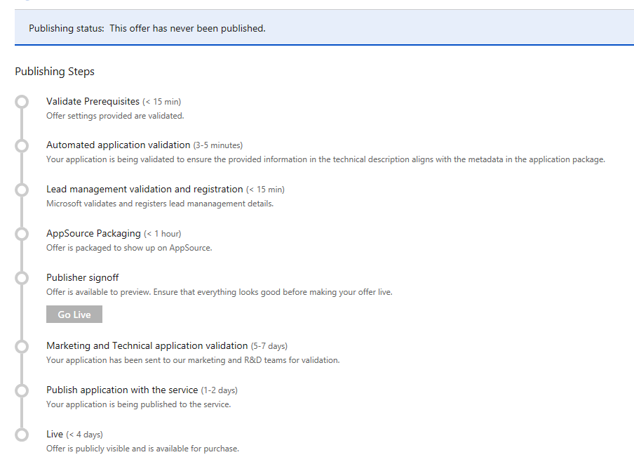

App Publishing Steps
====================

To start the Publish process, you will click "Publish" under the Editor
tab.

Under the Status tab, you will see the Publishing Steps indicating where
your offer is in the publishing process. At any point in the publishing
process, you can also sign in and click the All Offers tab to view the
latest status for any of your offers. You can click directly on the
status for your offer and see the details on where your offer is in the
publishing process.

Let's walk through each of the publishing steps, discuss what happens at
each step and how long you should estimate each step will take.

**Validate Prerequisites**

When you click "Publish", an automated check will take place to ensure
you've populated all the required fields on your offer. If any fields
are not populated, a warning will appear next to the field and you will
need to populate it accurately then click 'Publish' again.

Once you've completed this step correctly, a pop-up will appear asking
for an email address, which will be used to send you publishing notifications. 
Once you submit your email address, this step is complete.

**Automated application validation**

In this step, our automated certification service checks application
extensions provided with an offer that their content aligns with offer
metadata. Always make sure that your app name, version, publisher, and ID
matches with provided in extension manifest named `app.json`.

**Test Drive validation**

If you have opted to set up Test Drive, this stage is where your Test
Drive settings are validated.

**Lead management validation and registration**

During this stage, if you configured the Lead Generation feature, we
will validate that your CRM integration is working by sending a test
lead to your CRM. You will see a record with fake data populate in your
CRM or Azure Table after this step is complete. All documentation for
Lead Generation is located here.

**AppSource packaging**

Your Storefront details artifacts are being checked and AppSource
preview package is being generated.

**Publisher sign out**

During this stage, the **Go Live** button will now become active. You will
also now have a link to preview your offering (with your hidekey). Once
you are happy with how your preview looks, click the Go Live button.
Keep in mind, this request does not make your app live on App Source, but 
instead it triggers our internal validation process.

**Marketing and Technical application validation**

This step is where we conduct the marketing and technical validations in
parallel. Refer to the
[Checklist for Submitting Your App](https://aka.ms/CheckBeforeYouSubmit) and
[Developing Apps for Dynamics 365 for Finance and Operations white paper](https://go.microsoft.com/fwlink/?linkid=841518) guidance
docs for mandatory requirements and recommendations. During the
validation process, we will:
-  work with you on any outstanding questions and issues.  
- provide you with an app publishing date, and notify you when your app is published. 
- provide you with a first feedback concerning the technical and the marketing validation within 5-7 business days.

These steps can typically take over a week, and there is no need for you to stay continuously logged into the Cloud
Partner Portal.

**Publish application with the service**

Your offer is going through some final processing. Your app has passed
both marketing and technical validation, but must now go through some
final processing to make it ready for App Source.

**Live**

Your offer is now Live on AppSource, and customers will be able to view
and deploy your app in their Microsoft Dynamics 365 Business Central
subscriptions. You will receive an e-mail from us, notifying you that
your app has been made public on App Source. At any point, you can click
on the All offers tab, and see the status for all your offers listed on
the right column. You can click on the status to see the publishing flow
status in detail for your offer.

Error Handling
--------------

During the publishing process, an error may be encountered. If an error
is encountered, you will receive a notification email informing you that
an error occurred with instructions on next steps. You can also see
errors at any time during this process by clicking the Status tab. You
will see which point in the process the error occurred along with an
error message outlining what needs to be resolved.

If you encounter errors during the publishing process, you are
required to fix these errors, then click **Publish** to restart the process. You
must start at the beginning of the publishing steps at **Validate
Pre-Requisites** when republishing after any error fix.

If you are having issues resolving an error, you should open a support
request to get help from our support engineers.

Canceling the publishing request
--------------------------------

You might start the process of publishing and have a need to cancel your
request. You can only cancel a publishing request once the publish
request reaches the Publisher Signoff step. To cancel, click on **Cancel
Publish**. The publishing status will reset to Step 1, and to publish
again, you should click Publish and follow the steps in the status.

